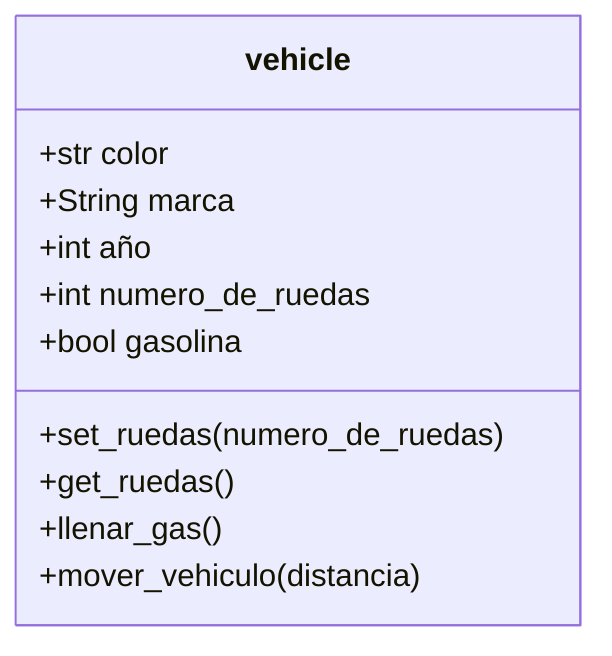

```mermaid
---
Class vehículo
---

classDiagram
    vehicle : +str color
    vehicle : +String marca
    vehicle : +int año
    vehicle : +int numero_de_ruedas
    vehicle : +bool gasolina
    vehicle: +set_ruedas(numero_de_ruedas)
    vehicle: +get_ruedas()
    vehicle: +llenar_gas()
    vehicle: +mover_vehiculo(distancia)

```