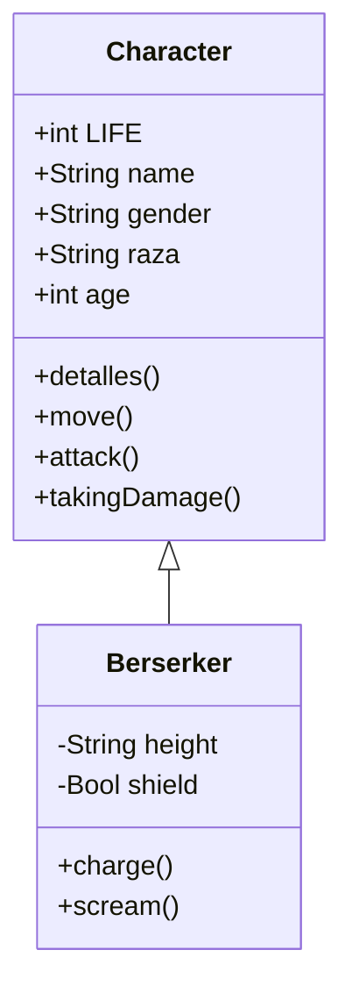

```mermaid
    classDiagram
        Character <|-- Berserker
        Character : +int LIFE
        Character : +String name
        Character : +String gender
        Character : +String raza
        Character : +int age
        Character : +detalles()
        Character: +move()
        Character: +attack()
        Character: +takingDamage()
        class Berserker{
            -String height
            -Bool shield
            +charge()
            +scream()
        }
```