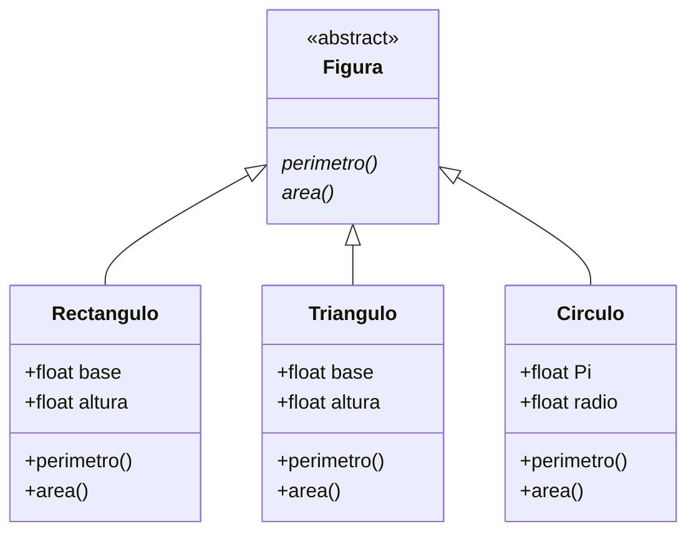

```mermaid
    classDiagram
        class Figura
        <<abstract>> Figura
        Figura <|-- Rectangulo
        Figura <|-- Triangulo
        Figura <|-- Circulo
        Figura : perimetro()*
        Figura : area()*
        class Rectangulo {
            +float base
            +float altura
            +perimetro()
            +area()
        }
        class Triangulo {
            +float base
            +float altura
            +perimetro()
            +area()
        }
        class Circulo {
            +float Pi
            +float radio
            +perimetro()
            +area()
        }
```