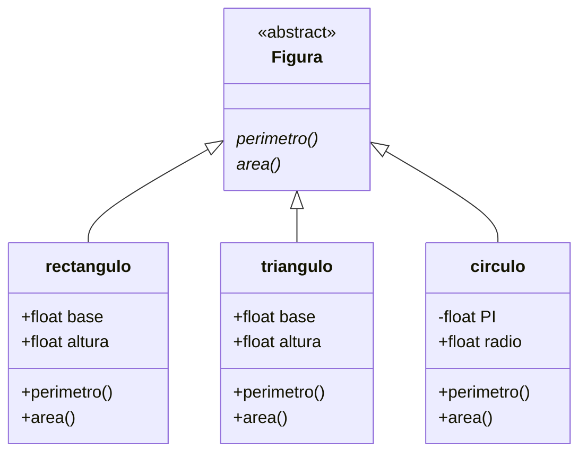

```mermaid
    classDiagram
        class Figura
        <<abstract>> Figura
        Figura <|-- rectangulo
        Figura <|-- triangulo
        Figura <|-- circulo
        Figura : perimetro()*
        Figura : area()*
        class rectangulo {
            +float base
            +float altura
            +perimetro()
            +area()
        }
        class triangulo {
            +float base
            +float altura
            +perimetro()
            +area()
        }
        class circulo {
            -float PI
            +float radio
            +perimetro()
            +area()
        }
```